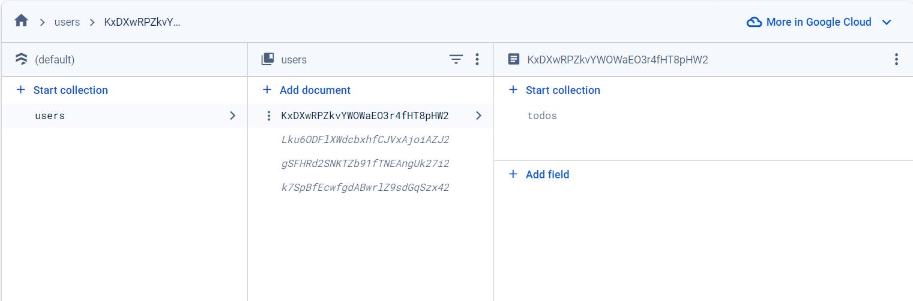
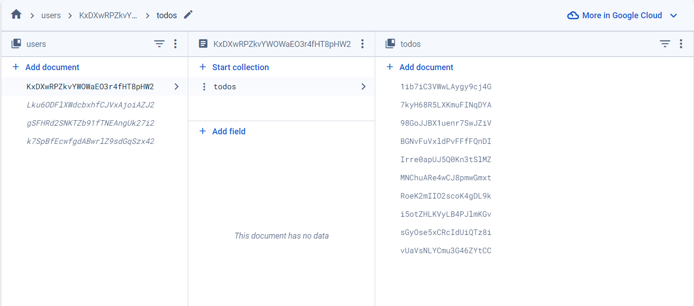
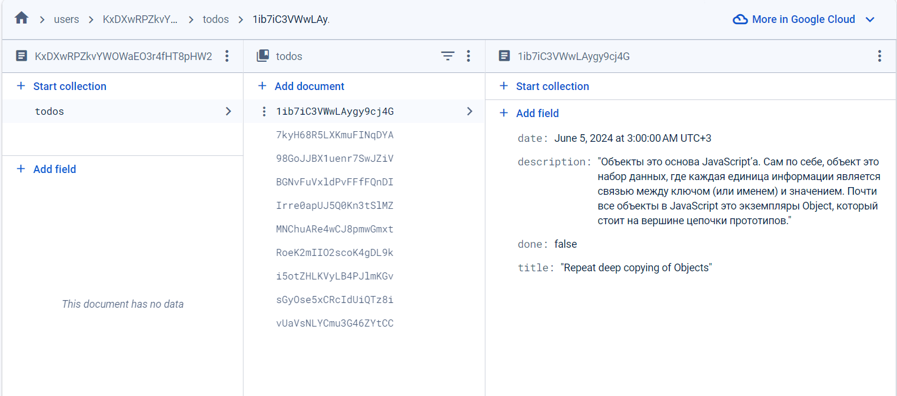

<h1>Innowise lab internship level 1 Clever To Do List</h1>

<h2>1. Link to the task</h2>

https://drive.google.com/file/d/18I1PxOxZn2lwm__YeOtMNoWeiXygKwwN/view

<h2>2. How to run the app</h2>

- `https://github.com/AlekseyYuriev/innowise-lab-internship-level-1-clever-to-do-list.git` - clone the repository (HTTPS)
- `npm install` - install the dependencies
- `npm run dev` - run the app

<h2>3. Database snapshot</h2>
The entities structure in firebase is organized the following way:

